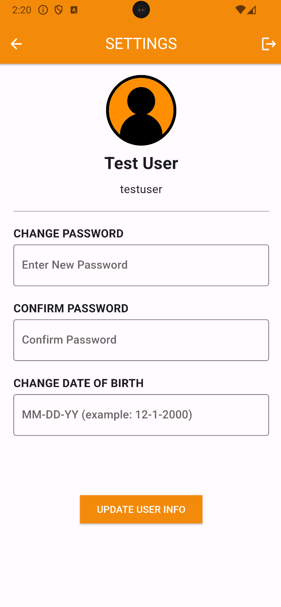

# Annonymous Chat App


  

  


<!--


 -->


## Overview
Welcome to the Chat App project repository! This Chat App project is developed using Flutter and incorporates Firestore for real-time database interactions and Firebase Authentication for user authentication. The app allows users to send and receive messages instantly, providing a seamless communication experience. By leveraging the Flutter framework, the app offers a responsive and intuitive user interface, making it accessible across multiple devices.

## Notice:
- Please note that this app is a demo and does not encompass all the features of a fully developed chat application. It's intended for demonstration purposes, illustrating basic functionalities such as user authentication and real-time messaging within a simplified framework.

## Project Proposal
Chat App: A real-time messaging application allowing users to communicate with each other. The app supports authentication, real-time messaging, and is designed to be cross-platform, ensuring a consistent user experience across devices. The goal is to create a simple, user-friendly app that facilitates effortless communication.

## Tech Use
- **Flutter**: An open-source UI software development kit created by Google.
- **Firestore**: A flexible, scalable database for mobile, web, and server development from Firebase and Google Cloud.
- **Firebase Authentication**: A service that can authenticate users using only client-side code. It supports social login providers like Google, Facebook, and Twitter, as well as email and password login.
- **intl**: Provides internationalization and localization facilities, including message translation, plurals and genders, date/number formatting and parsing, and bidirectional text.
- **Git**: Version control system for collaboration and code management.
- **Code Editors and IDEs**: Android Studio or Visual Studio Code.

## Running Application

To run the Chat App on your local machine, follow these steps:

### Prerequisites

1. **Flutter SDK**: Ensure Flutter is installed on your system. If not, follow the [official installation guide](https://flutter.dev/docs/get-started/install) provided by Flutter.

2. **Code Editor**: Download and install Android Studio or Visual Studio Code.

3. **VSCode Extensions or Android Studio Plugins**: Flutter and Dart plugins for Android Studio or Visual Studio Code.

### Steps

1. **Clone the Repository**
   ```bash
   git clone https://github.com/Quan987/ChatApp.git
   ```
   
2. **Navigate to the Project Directory**

3. **Open the project in your code editor**

4. **Ensure dependencies in `pubspec.yaml` are up to date, especially `cloud_firestore`, `firebase_auth`, and `intl`**

5. **Run the Main.dart file to start the app**

   Alternatively, you can build an APK and install it on an Android device:
   ```bash
   flutter build apk
   ```
6. **Run flutter run --debug in terminal and select emulator or device to add nessesary file for project to work**

6. **Follow on-screen instructions to log in or sign up**

7. **Start chatting with other users in real-time**

8. **Please use the login: "test@gmail.com" and password: "password" for pre-demo of app**

## Additional Notes

- **Running on a Device**: To run the app on a physical device, ensure developer mode is enabled on the device and it is connected to your development machine.

- **Emulator/Simulator**: You can also run the app using an emulator or simulator provided by Android Studio or Visual Studio Code.

- **Do not modify system files or dependencies without understanding their impact as it may affect the app's functionality.**

## Contributing
Contributions are welcome! If you're interested in improving the Chat App or adding new features, please feel free to fork the repository and submit a pull request.

## License
This project is licensed under the [MIT License](https://opensource.org/licenses/MIT).
